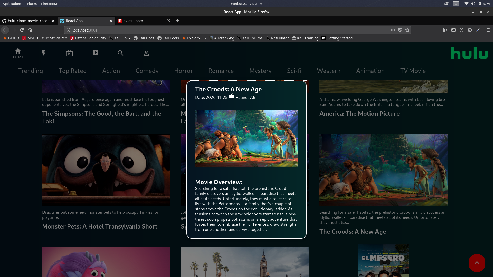

# hulu-clone-movie-recommendation made using Reactjs

<h2>how to start?</h2>
npm create-react-app hulu
<p>The above command will create the app for you</p>
<p>Now replace the src folder from the repo with your src folder that you have just created</p>
<h2>Install some extra packages</h2>
<p>npm install @material-ui/core</p>
<p>npm install @material-ui/icons</p>
<p>npm i react-dom</p>
<p>npm i react-flip-move</p>
<p>npm i axios</p>
<h2>Then run the server</h2>
<p>npm start </p>

<h2>Project Overview</h2>
  
  
  
  
  
<h2>Api used</h2>

https://image.tmdb.org/t/p/original/

```javascript
const base_url = 'https://image.tmdb.org/t/p/original/';
```
<p>Extration of different genre of movies from api</p>

```javascript
const API_KEY = '580908a****************53d16d7e';

export default {
    fetchTrending: `/trending/all/week?api_key=${API_KEY}&language=en-US`,
    fetchTopRated: `/movie/top_rated?api_key=${API_KEY}&language=en-US`,
    fetchActionMovies: `/discover/movie?api_key=${API_KEY}&with_genres=28`,
    fetchComedyMovies: `/discover/movie?api_key=${API_KEY}&with_genres=35`,
    fetchHorrorMovies: `/discover/movie?api_key=${API_KEY}&with_genres=27`,
    fetchRomanceMovies: `/discover/movie?api_key=${API_KEY}&with_genres=10749`,
    fetchMystery: `/discover/movie?api_key=${API_KEY}&with_genres=9648`,
    fetchSciFi: `/discover/movie?api_key=${API_KEY}&with_genres=878`,
    fetchWestern: `/discover/movie?api_key=${API_KEY}&with_genres=37`,
    fetchAnimation: `/discover/movie?api_key=${API_KEY}&with_genres=16`,
    fetchTV: `/discover/movie?api_key=${API_KEY}&with_genres=10770`,
};

```
<p>you can get your api key by registration in the tmdb.org website</p>

https://developers.themoviedb.org/3/getting-started/introduction

<p>Requesting data from api using Axios</p>

```javascript
import axios from 'axios';

const instance = axios.create({
    baseURL:"https://api.themoviedb.org/3",
});

export default instance;
```

